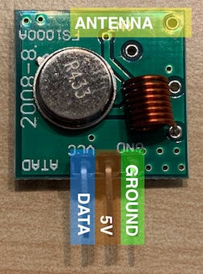

# PiWaveRF

Turning a Raspberry Pi into a first-gen LightwaveRF hub.

Currently at a very early stage, but the goal is to allow light control via the same UDP protocol as the Hub, hence allowing it to work with the [Homebridge plugin](https://github.com/rooi/homebridge-lightwaverf).

This is very much in debt to [Robert Tidey's LightwaveRF work](https://github.com/roberttidey/LightwaveRF), and uses his transmission logic.

## Hardware

* A [433Mhz transmitter module](https://www.amazon.co.uk/gp/product/B07B9KV8D9/)
* 3 x [Female-to-female jumper cables](https://www.amazon.co.uk/gp/product/B01EV70C78/)
* A [Raspberry Pi](https://www.raspberrypi.org/products/), in my case a 3B+.

## Wiring

Given the [GPIO port](https://www.raspberrypi.org/documentation/usage/gpio/):

* Data to pin 12 (GPIO18)
* 5V to pin 1 (5V)
* Ground to pin 3 (Ground)

It's also worth adding on an antenna to the board - 170mm of wire should be about a quarter-wavelength.



## Prerequisies

* [Rasbpian](https://www.raspberrypi.org/downloads/) 10.3 (in this case, shouldn't be particularly tied to it)
* [Pigpio](http://abyz.me.uk/rpi/pigpio/):

   ```bash
   sudo apt install pigpio
   sudo systemctl enable pigpiod
   sudo systemctl start pigpiod
   ```

## Usage

This is at a very early stage at present. However, you can use it to pair and turn a light on/off.

```bash
pywaverf/main.py --help # show usage info

pywaverf/main.py pair --room 1 --unit 3 # pair a unit - make sure the unit is in pairing mode first

pywaverf/main.py on --room 1 --unit 3 # turn a paired unit on
```

## References

* [433Mhz protocol](https://github.com/roberttidey/LightwaveRF/blob/master/LightwaveRF433.pdf)
* [UDP hub protocol](https://github.com/openremote/Documentation/wiki/LightwaveRF)
